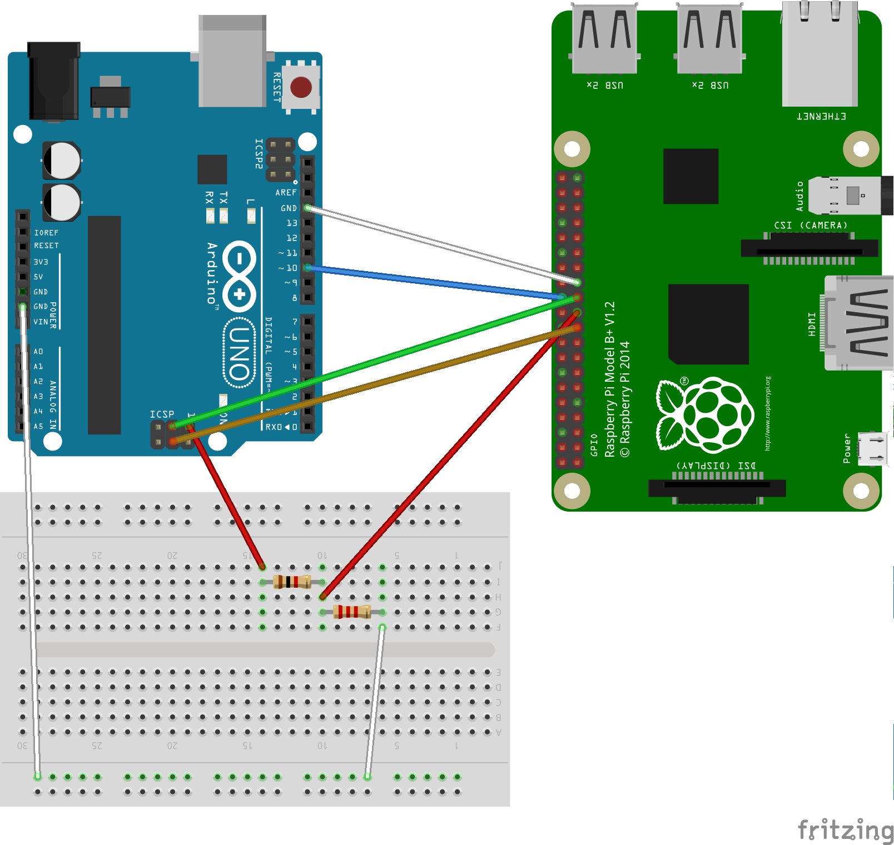

# SPI Hardware Configuration

There are several ways to connect Raspberry Pi and Arduino together; one of these is using a serial peripheral communication protocol ([SPI](../user/spiProtocol.md)) and assuming RPI as Master device and Arduino as Slave.

## Requirements

- RaspberryPi B+ (Other versions may can have different GPIO scheme. See related [page](https://www.raspberrypi.org/documentation/usage/));
- Arduino Uno (Other versions, if equipped, SPI communication may be use different pins. See related Arduino boards [page](https://www.arduino.cc/en/Products/Compare));
- wire cables Male/Female (or if you have a Raspberry breadboard adapter like [this](https://blog.adafruit.com/2012/07/10/breadboard-adapter-for-the-raspberry-pi/), Male/Male wires are ok);

## Master side
Raspberry Pi is an ARM based board and pins enabled to establish an SPI communication are:
- 19 for MOSI line;
- 21 for MISO line;
- 23 for CLK line;
- 24 for CE0 (and 25 for CE1);
- 6,9,14,20,25,30,34,39 for ground (obviously just one of these is needed).

## Slave side
Other than classic digital pins (see [here](http://arduinodev.com/arduino-spi-lines-difference/)), Arduino uno also uses the ICSP header to enable SPI communication:
- ICSP 1 for MISO line;
- ICSP 4 for MOSI line;
- ICSP 3 for CLK line;
- 10 for SS line.
- ICSP 6 or other GND pins for ground.

## Connections and Voltage divider

Hardware side is the following: MOSI master pin is directly connected with MOSI slave pin and CLK master pin to CLK slave pin; usually if Arduino is Master we can connect SS in the remaining pins, but when it is slave SS should be connected on pin 10. On Raspberry Pi SS is connected at CE0.

Now pay attention at MISO line, it is not directly connected and the reason is found about boards voltages. Default Raspberry PI power is 3.3V of energy meanwhile Arduino Uno is 5V; so we don't have problems for MOSI line because it is powered by Raspberry PI, but MISO after long time can bring problems at Raspberry (neither smoke or fire, it just stops working).
To reduce this power we use a technique called Voltage divider. There are several [ways](http://www.instructables.com/id/Arduino-to-RPi-three-ways-to-convert-5-volts-to-33/?ALLSTEPS), but the simplest is put 2 resistors which R2 should be double R1. The reason is given by output voltage formula: `Vout = Vin*(R2/(R2+R1))`, 3.3V is 2/3 of 5V. I used one resistor of 1K ohm and one of 2K ohm; finally, voltage is reduced connecting the second end of 2R resistor to ground.

## References

- [Gammon Forum](http://www.gammon.com.au/forum/?id=10892)
- [instructables](http://www.instructables.com/id/Arduino-to-RPi-three-ways-to-convert-5-volts-to-33/?ALLSTEPSV)

Go back to [summary](../summary.md)
