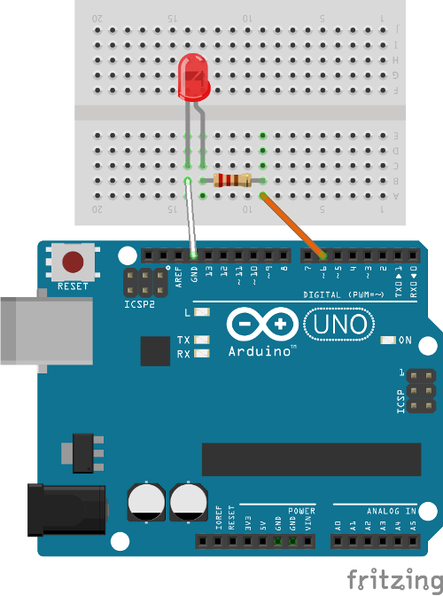

# Control LED brightness using Arduino

This example shows how to manage brightness of a LED using Arduino

## Requirements

- Arduino Uno;
- 1x LED (I chose red color);
- 1x 220 Ohm resistance
- 1x Raspberry Pi (to command Arduino through SPI)

## Hardware connection



Hardware connection is pretty simple. Above is reported a fritz that connect a LED on Arduino: LED catode is connected with ground while anode part with 220ohm resistance and the with an Arduino pin. Pay attection on which pin you choose: Arduino has 13 digital pin and just six of them are enabled to work and are 3, 5, 6, 9, 10, 11.

## Analog Control (PWM)

Writes an analog value to a pin can be use to control LED brightness or speed motor. PWN is a tecnique to have analog results using digital means. Digital control is used to create a square wave, a signal switched between on and off. This pattern can simulate full on and off (5V to 0V and vice versa) by changing the portion of the time that the signal spends on versus the time that the signal spend off.


Above image shows as the portion of period is inverse of frequency; more perid minus frequency. So Arduino frequency is about 500Hz when high and each block of time is 2 milliseconds. Using `analogWrite()` function we can manage this duty cicle using a value between 0 and 255, where 255 is 100%. In other words, what pulse width modulation do is light on and off rapidly and constantly so to our eyes the movement blures each LED blink into a line. As the LED fade in and out, those little lines will grow and shrink in length. Now you are seeing the pulse width.

## Arduino code

Now we are going to code Arduino.

```c++
const int led = 6;           // the PWM pin the LED is attached to
int brightness;    // how bright the LED is
int fadeAmount;    // how many points to fade the LED by

// the setup routine runs once when you press reset:
void setup() {
  // declare pin 6 to be an output:
  pinMode(led, OUTPUT);
  brightness = 0;
  fadeAmount = 2;
}

// the loop routine runs over and over again forever:
void loop() {
  // set the brightness of pin 6:
  analogWrite(led, brightness);

  // change the brightness for next time through the loop:
  brightness = brightness + fadeAmount;

  // reverse the direction of the fading at the ends of the fade:
  if (brightness <= 0 || brightness >= 255) {
    fadeAmount = -fadeAmount;
  }
  // wait for 30 milliseconds to see the dimming effect
  delay(30);
}
```
First of all on `setup` function we have to declare pin behavior, then start brightness to 0 and `fadeAmount` to 2 (we'll use this to add or subtract fade to brightness).
In `loop` function instead we set LED brightness using `analogWrite()` and we will change brightness value for the next time through the loop. When brightness value is maior or equal to 255 we will reduce it with a negative fadeAmount.

## Manage Brightness LED through SPI

Above code is an example to control LED brighness using just an Arduino. Here we want manage it through a Rasperry pi connected with Arduino via SPI communication. To learn more about SPI protol see [previous](../summary.md) documentation.

## Arduino code


### SPISlave.ino

```c++
#include "spiSlaveManager.h"
#include "heaterManager.h"

SpiSlaveManager spiSM = SpiSlaveManager(); // SPI class
HeaterManager heaterManager(9,0);

void setup (void) {

  Serial.begin (9600);

  //SPI position buffer initialization
  spiSM.inOutbf_.bufferPosition_ = 0;

}
void loop (void) {
  
  if (spiSM.isByteReceived()) { //if byte has been received
    
    if (spiSM.inOutbf_.bufferPosition_ < spiSM.inOutbf_.bufferData_.size())
      spiSM.inOutbf_.bufferPosition_++;
    else {
      spiSM.inOutbf_.bufferPosition_ = 0;
      spiSM.inOutbf_.bufferData_.clear();
    }

    byte data = SPDR; // read SPI data register
    spiSM.inOutbf_.bufferData_.push_back(data); //fill incomingBufferData

    Serial.print("buffPos ");
    Serial.println(spiSM.inOutbf_.bufferPosition_);

    // If a '6' value is stored on buffer	
    if (spiSM.inOutbf_.bufferData_[spiSM.inOutbf_.bufferPosition_] == '6'){
	
      //all values are in percentage      

      heaterManager.increaseBrightness(100);
      delay(1000);
      heaterManager.decreaseBrightness(50);
      delay(1000);
      heaterManager.decreaseBrightness(100);
    }
  }
}
```
To understand SPI class see [./spiSWbasicSlave.md](SPI basic slave code). If '6' value is stored on incoming buffer we will increase Brightness of 100%, wait 1000 milliseconds, decrease of 50%, wait 1000% and then decrease of 100%. All percentages are related to total: 0% is equal to 0 and 100% is equal to 255.

### heaterManager.h

```c++
#ifndef HEATER_MANAGER_H
#define HEATER_MANAGER_H

#include <Arduino.h>

class HeaterManager {
  public:
    int ledPin_;
    const int minBrightness_ = 0;
    const int maxBrightness_ = 255;
    int currentBrightness_;

  public:
    HeaterManager(int ledPin, int startBrightness);

    int increaseBrightness(int incrementValue);
    int decreaseBrightness(int decrementValue);
  };

#endif
```

### heaterManager.cpp

Class heaterManager has three functions:

- costructor is designed to instatiate class and set default values as `ledPin_`, `currentBrightness` and `pinMode`;
- `increaseManager` method take a percentage of increment as input, and fade in current brightness of a given value;
- `decreaseManager` take as input a percentage of decrement and fade out current brightness of a given value.

```c++
#include "heaterManager.h"

HeaterManager::HeaterManager(int ledPin, int startBrightness) {
  ledPin_ = ledPin;
  pinMode(ledPin_, OUTPUT);
  currentBrightness_ = startBrightness;
  analogWrite(ledPin_, currentBrightness_);
}

int HeaterManager::increaseBrightness(int incrementValue) {
    int brightness = currentBrightness_;
  int fadeAmount = 2;
  // x:maxBrightness = incrementValue:100
  int percentage = (incrementValue * maxBrightness_) / 100;

  if ((currentBrightness_ + percentage) >= maxBrightness_)
    currentBrightness_ = maxBrightness_;
  else
    currentBrightness_ += percentage;

  bool done = false;
  while (done == false) {
    analogWrite(ledPin_, brightness);

    // change the brightness for next time through the loop:
    brightness = brightness + fadeAmount;

    // reverse the direction of the fading at the ends of the fade:
    if (brightness >= currentBrightness_) {
      done = true;
    }
    // wait for 30 milliseconds to see the dimming effect
    delay(30);
  }

  return currentBrightness_;
}

int HeaterManager::decreaseBrightness(int decrementValue) {
  int brightness = currentBrightness_;
  int fadeAmount = 2;

  //x:maxBrightness = decrementValue : 100
  int percentage = (decrementValue * maxBrightness_) / 100;
  if (currentBrightness_ - percentage <= minBrightness_)
    currentBrightness_ = minBrightness_;
  else
    currentBrightness_ -= percentage;

  bool done = false;
  while (done == false) {
    analogWrite(ledPin_, brightness);

    // change the brightness for next time through the loop:
    brightness = brightness - fadeAmount;

    // reverse the direction of the fading at the ends of the fade:
    if (brightness <= currentBrightness_) {
      done = true;
    }
    // wait for 30 milliseconds to see the dimming effect
    delay(30);
  }

  return currentBrightness_;
}

```

## Raspberry Pi code

Raspberri py code is equal to [SPI master basic code](./spiSWbasicMaster.md) seen before.


## References

- [Arduino analogWrite](https://www.arduino.cc/en/Reference/AnalogWrite)
- [Arduino PWM](https://www.arduino.cc/en/Tutorial/PWM)


Go back to [summary](../summary.md).
