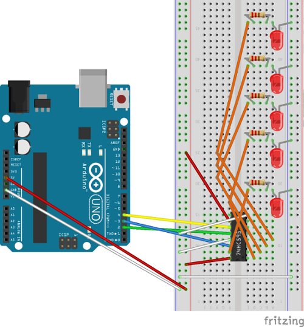

# Manage a shift register using SPI communication 

In this section we connect a shift register to Arduino Uno to light on/off 5 LEDS with Raspberry Pi throw SPI communication.

## Requirements

- Arduino Uno
- Raspberry Pi
- 1x 74HC595 shift register
- 5x resistors 220 Ohm
- 5x LEDS
- wires 

## The 74HC595 shift register

A shift register is a chip that has an 8 bits memory; it takes these data through a serial communication and each value is set using the Data and Clock pins of chip. When the clock pin receive an impulse, if it is high an 1 gets pushed into a shift register a 0 otherwise. If all eight pulses have been received, then enabling the Latch pin copies these 8 bits to the latch register. This is necessary as to avoid both wrong LEDS turning on as flickering.

## Hardware connection 



Above fritz shows how connect shift register to Arduino assuming that it is communicated with Raspberry Pi using SPI (if you skip this see [here](../install/hardwareConfiguration.md)).
The 74HC595 is a serial to parallel shift register and has 16 pins. If you take the "half circle" on your right, the first seven pins placed above (from right to left) are parallel data output and 8th pin is ground. Then below, from right to left we have Vcc, parallel output 0, serial data input, output enable input, latch pin, clock input, supply voltage and Serial data output. So as you can see you should connect 5 LEDS from Q0 to Q4 using 5x 220 Ohm resistors.

## Arduino code

Starting from [basic Arduino code](./spiSWbasicSlave) we add Arduino example code to manage shift register.

SPISlave.ino

```c++
#include "spiSlaveManager.h"
#include "shiftRegManager.h"

SpiSlaveManager spiSM = SpiSlaveManager(); // SPI class
ShiftRegManager srm(2, 3, 4); //set shiftRegister latchPin, dataPin and clockPin

void setup (void) {

  Serial.begin (9600);

  //SPI position buffer initialization
  spiSM.inOutbf_.bufferPosition_ = 0;

  delay(10);
}

void loop (void) {
  if (spiSM.isByteReceived()) { //if byte has been received

    
    if (spiSM.inOutbf_.bufferPosition_ < spiSM.inOutbf_.bufferData_.size())
      spiSM.inOutbf_.bufferPosition_++;
    else {
      spiSM.inOutbf_.bufferPosition_ = 0;
      spiSM.inOutbf_.bufferData_.clear();
    }

    byte data = SPDR; // read SPI data register
    spiSM.inOutbf_.bufferData_.push_back(data); //fill incomingBufferData

    Serial.print("buffPos ");
    Serial.println(spiSM.inOutbf_.bufferPosition_);

    if (spiSM.inOutbf_.bufferData_[spiSM.inOutbf_.bufferPosition_] == '7') {
      srm.updateShiftRegister(srm.turnONLeds(5));
      delay(1000);
      srm.updateShiftRegister(srm.turnONLeds(2));
      delay(1000);
      srm.updateShiftRegister(srm.turnOFFLeds(2));
      delay(1000);
    }
    srm.statusLeds_ = 0;
    srm.updateShiftRegister(srm.statusLeds_);

  }
}
```

*If* statement control if a  given char is arrived from Raspberry Pi; in this case we first turn on first and third led (5 DEC = 101 BIN), wait 1K milliseconds, turn on second led, wait and turn off the last pin lighted on.

`srm.turnONLeds(byte)` take a byte as input and calculate an OR operation between new status and current status on shift register.
Otherwise, to turn off leds `srm.turnOFFLeds(byte)` take a byte as input, make a NOT operation on byte input, and the new current state is calculated using an AND operation between this byte and current shift register state.
Return statement is taken by `srm.updateShiftRegister(byte)` which perform a shiftOut operation after that we take low latch pin. ShiftOut operation take as input clock line, data line, bit wise, and new shift register status. Finally, we take HIGH latch pin.

shiftRegManager.h

```c++
#ifndef SHIFT_REG_H
#define SHIFT_REG_H

#include <Arduino.h>

class ShiftRegManager{
  public:
    int latchPin_;
    int dataPin_;
    int clockPin_;
    byte statusLeds_ = 0;
    
  public:
    ShiftRegManager(int latchPin,int dataPin,int clockPin);
   
    // other methods
    byte turnONLeds(byte newStatus); // turn on leds
    byte turnOFFLeds(byte newStatus); // turn off leds 
    void updateShiftRegister(byte statusLeds); //send new leds status to shiftRegister

};
#endif
```

shiftRegManager.cpp

```c++
#include "shiftRegManager.h"

ShiftRegManager::ShiftRegManager(int latchPin,int dataPin,int clockPin){
  latchPin_ = latchPin;
  dataPin_ = dataPin;
  clockPin_ = clockPin;
  pinMode(latchPin_, OUTPUT);
  pinMode(dataPin_, OUTPUT);
  pinMode(clockPin_, OUTPUT); 
  }

byte ShiftRegManager::turnONLeds(byte newStatus){
  byte data = statusLeds_;
  data |= newStatus;
  statusLeds_ = data;
  return statusLeds_;
}

byte ShiftRegManager::turnOFFLeds(byte newStatus){
  byte data = statusLeds_;
  newStatus = ~newStatus;
  data &= newStatus;
  statusLeds_ = data;
  return statusLeds_;
}

void ShiftRegManager::updateShiftRegister(byte statusLeds){
  digitalWrite(latchPin_, LOW);
  shiftOut(dataPin_, clockPin_, MSBFIRST, statusLeds); //send data to shift register
  digitalWrite(latchPin_, HIGH);
}
```

## Raspberry Pi basic code

This tutorial requires Master side basic [code](./spiSWbasicMaster.md).

## References

- [Adafruit tutorial](https://learn.adafruit.com/adafruit-arduino-lesson-4-eight-leds/the-74hc595-shift-register)
- [The 74HC595 datasheet](http://www.nexperia.com/catcher/74HC_HCT595.pdf?)

Go back to [summary](../summary.md)

