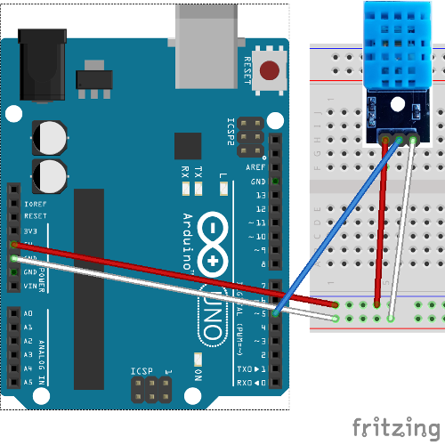

# Manage a humidity and temperature sensor using SPI communication

Here we want connect a humidity and temperature sensor and manage them with Raspberry Pi using SPI communication.

## Requirements

- Arduino Uno
- Raspberry Pi
- KY-015 humidity and temperature Sensor
- wires

## Arduino KY-015

DHT11 is a calibrated digital signal output temperature and humidity combined sensor, which application specific modules capture technology ensures an excellent long-term stability. It requires 3.3 ~ 5.5V supply voltage, measure humidity between 20-90% (with accuracy +/-5%)  and temperature from 0 to 50°C (with accuracy +/-2°C). It has three output pins: the first on the left is a Vcc pin, middle is digital pin out and pin on the right side is Ground.

## Hardware connections



This fritz shows as DHT11 can be connected. To enstablish an hardware SPI communication see related [page](../install/hardwareConfiguration.md).
As you can see to rely KY-015 is pretty simple: connects Vcc on Arduino 5V, GRD to GRD and out pin to an Arduino's digital pin (I chose 5).

## Arduino code
Starting from [basic Arduino code](./spiSWbasicSlave) we add Arduino example code to manage DHT11.

SPISlave.ino

```c++
#include "spiSlaveManager.h"
#include "tempSens.h"

SpiSlaveManager spiSM = SpiSlaveManager(); // SPI class
TempSensManager tempS(5); //Sensor Temperature class manager

int i;
void setup (void) {

  Serial.begin (9600);

  //SPI position buffer initialization
  spiSM.inOutbf_.bufferPosition_ = 0;

  //temp var used for tries
  i = 0;

  delay(10);
}

void loop (void) {
  if (spiSM.isByteReceived()) { //if byte has been received

    
    if (spiSM.inOutbf_.bufferPosition_ < spiSM.inOutbf_.bufferData_.size())
      spiSM.inOutbf_.bufferPosition_++;
    else {
      spiSM.inOutbf_.bufferPosition_ = 0;
      spiSM.inOutbf_.bufferData_.clear();
    }

    byte data = SPDR; // read SPI data register
    spiSM.inOutbf_.bufferData_.push_back(data); //fill incomingBufferData

    Serial.print("buffPos ");
    Serial.println(spiSM.inOutbf_.bufferPosition_);

    if (spiSM.inOutbf_.bufferData_[spiSM.inOutbf_.bufferPosition_] == '8') {
      delay(500);

      switch (i) {
        case 0:
          Serial.println(i);
          tempS.checkTemp();
          i++;
          Serial.println(i);
          break;
        case 1:
          SPDR = tempS.tempData_[2];
          i++;
          Serial.println(i);
          break;
        case 2:
          SPDR = tempS.tempData_[3];
          i = 0;
          Serial.println(i);
          break;
      }
      Serial.print("Temperature: ");
      Serial.print(tempS.tempData_[2]);
      Serial.print(".");
      Serial.println(tempS.tempData_[3]);
    }
  }
}
```

tempSens.h

```c++
#ifndef TEMP_SENS
#define TEMP_SENS

#include <Arduino.h>
#include "Array.h"

class TempSensManager {
  public:
    int tempPin_;

    Array<byte, 4> tempData_;
    
  public:
    TempSensManager(int tempPin);

    void checkTemp();
    byte readData();
    
};
#endif
```

tempSens.cpp

```c++
#include"tempSens.h"


TempSensManager::TempSensManager(int tempPin){
  tempPin_ = tempPin;  
  pinMode(tempPin_, OUTPUT);
}

void TempSensManager::checkTemp () {
  digitalWrite (tempPin_, LOW); // bus down, send start signal
  delay (30); // delay greater than 18ms, so DHT11 start signal can be detected
 
  digitalWrite (tempPin_, HIGH);
  delayMicroseconds (40); // Wait for DHT11 response
 
  pinMode (tempPin_, INPUT);
  while (digitalRead (tempPin_) == HIGH);
  delayMicroseconds (80); // DHT11 response, pulled the bus 80us
  if (digitalRead (tempPin_) == LOW);
  delayMicroseconds (80); // DHT11 80us after the bus pulled to start sending data

  for(int i =0 ; i<4; i++)
    tempData_[i] = readData();

  pinMode (tempPin_, OUTPUT);
  digitalWrite (tempPin_, HIGH); // send data once after releasing the bus, wait for the host to open the next Start signal
}


byte TempSensManager::readData() {
  byte data;
  for (int i = 0; i < 8; i ++) {
    if (digitalRead (tempPin_) == LOW) {
      while (digitalRead (tempPin_) == LOW); // wait for 50us
      delayMicroseconds (30); // determine the duration of the high level to determine the data is '0 'or '1'
      if (digitalRead (tempPin_) == HIGH)
        data |= (1 << (7-i)); // high front and low in the post
       
      while (digitalRead (tempPin_) == HIGH); // data '1 ', wait for the next one receiver
     }
  }
return data;
}
```
`checkTemp()` method waits some microseconds before check temperature, then set `pinMode` as output and send data on Arduino. Arduino saves these incoming data on array of size 4: first two block to save humidity data and the last ones for temperature. It's not possible calculate just one of them.

## Raspberry Pi code

This tutorial requires Master side basic [code](./spiSWbasicMaster.md) because we have to send three messages to receive entire temperature value. First message  is used to ask to Arduino to calulate current temperature, second one to send back the value before the comma and last one for the value after the comma.
We have to use this method because, as [said](./spiMasterSlaveDataflow.md), Arduino SPDR is an 8 bits register that communicate throw a synchronous communication as SPI is.


# Refereces

- [TkkrLab](https://tkkrlab.nl/wiki/Arduino_KY-015_Temperature_and_humidity_sensor_module)
