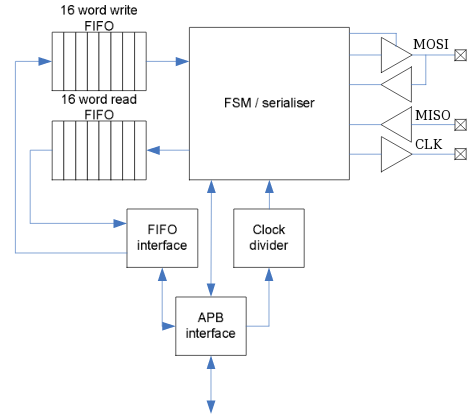
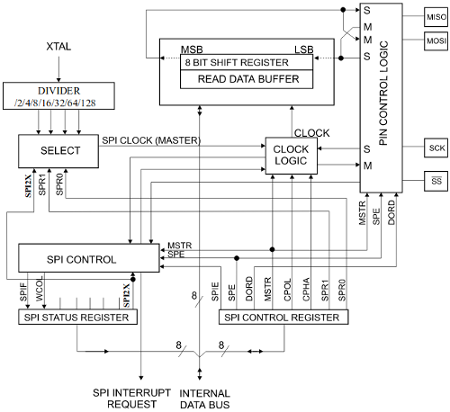

# Raspberry Pi-Arduino SPI DataFlow

Messages exchange between Raspberry Pi B+ and Arduino Uno require attention due to their different hardware configurations.

## Raspberry Pi SPI hardware

Broadcom 2835 mounted on Raspberry Pi B+ use the above SPI hardware block. It is made up of an FSM (Frame Sync Mode) that if it is equal to 0 we consider RPI as master, otherwise if 1 as slave. When master mode is enabled it takes the outgoing data from a FIFO queue (16 word write),the clock rate is managed from *clock divider* registry generating the frame sync signal to delimit the serial data into individual frames to send through MOSI line; the APB (Advanced peripheral bus) define clock to use during entire communication. If data are incoming FSM/Serialized send them to another FIFO queue of 16 words size.

## Arduino Uno SPI hardware

When configured as slave, the SPI interface will sleep until the SS pin is driven high from master. In this state, software can upload the content of SPI Data Register (SPDR) but the data will not shift out by incoming clock pulse on the SCK pin until the SS pin is driven low. When a byte has been shifted, the SPIF (end transmission flag) is set. As you can see, on the above picture SPI control register is a parallel to serial shift register used to manage default SPI setting. For example if you want Arduino as slave SPE must be set; same operation to enable interrupts, managing SPIE bit. SPI Status Register is a shift register with clock logic block and SPDR. SPDR is made of a shift register where incoming bits are written from MOSI line, or ready to shifted out using MISO communication. When last incoming byte is completly shifted it will be kept in the Buffer register for later use.
Is important notice that unlike RPI, Arduino is single buffered in the transmit direction and double buffered in the receive direction. This means that bytes to be trasmitted cannot be written to the SPI Data Register before the entire shift cycle il completed. The byte located on the receive buffer must be read before that next byte is entirely sent or it will be overwritten. Therefore, reading SPDR is equal to read receive buffer and write operation is write shift register; in our cases synchronize a request and a response is like to send two messages from master to slave. For example if RPI ask to take temperature, slave makes operation and just when master requires response (using another message) slave send it back.

# References
- [ATmega328 DataSheet](http://www.atmel.com/Images/Atmel-42735-8-bit-AVR-Microcontroller-ATmega328-328P_Datasheet.pdf)
- [Broadcom2835 Datasheet](https://www.raspberrypi.org/wp-content/uploads/2012/02/BCM2835-ARM-Peripherals.pdf)
- [Robotics Hobbizine](http://robotics.hobbizine.com/raspiduino.html)

Go back to [summary](../summary.md)
